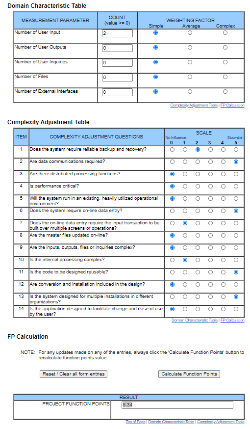

# DigitalJournal
## Use-Case Specification: Create a Class  v. <1.0>

## 1. Use-Case CreateAClass

### 1.1 Brief Description
In this UC we describe, how an Admin can create a new Class.

## 2. Flow of Events
Needs to be done....later
__picture must be inserted__

### 2.1 Basic Flow
The Basic flow of this UC is, that an admin creates a new class object in our persistent Database. He needs only a name of the new class. Every other variable gets generated automatically. He also needs to repeat the classname to minimize the chance of mistyping. If the two names match the new class gets written to the Database.

### 2.2 Name not met the conditions
 __picture must be inserted__

### 2.2 Repeated Name
The name exists in the Database. We send an alert message to the admin, that the name is already into the DB, and he must choose another name. We believ that a classname is *unique*.
 __picture must be inserted__

### 2.3 Name with "unrecognizable" Characters
If the name contains a non ASCII Letter, we send an alert message dialog to the admin, that the name contains unrecognizable characters, and can not be written into the DB.
 __picture must be inserted__

## 3. Special Requirements
### 3.1 User needs to be an Admin
The user must have the needed rights as an admin to create a class.

## 4. Preconditions
### 4.1 User needs to be logged in
The user needs to be authentificated, to get the specific user rights.

## 5. Postconditions
### 5.1 New Class is created
A new class is created in the DB and accesable in the Admin GUI.
 __picture must be inserted__
  
## 6. Extension Points

